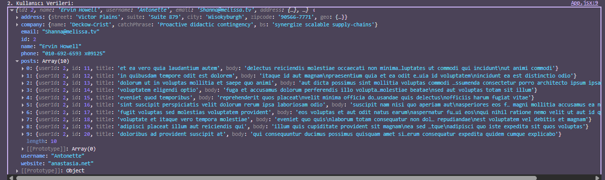

## Project Overview
This project demonstrates how to fetch user data and their posts using the Axios library from the JSONPlaceholder API. The main goal is to combine user information and their posts into a single object and display it in the console.

## Technologies Used
-JavaScript (ES6+)
-Axios
-Async/Await
-JSONPlaceholder API
-React (for demonstration in App.jsx)

## How It Works
-getData.js contains the function that fetches and combines user data and posts.
-App.jsx imports this function and calls it inside a useEffect to fetch data when the component mounts.
-The combined result is displayed in the browser console.
